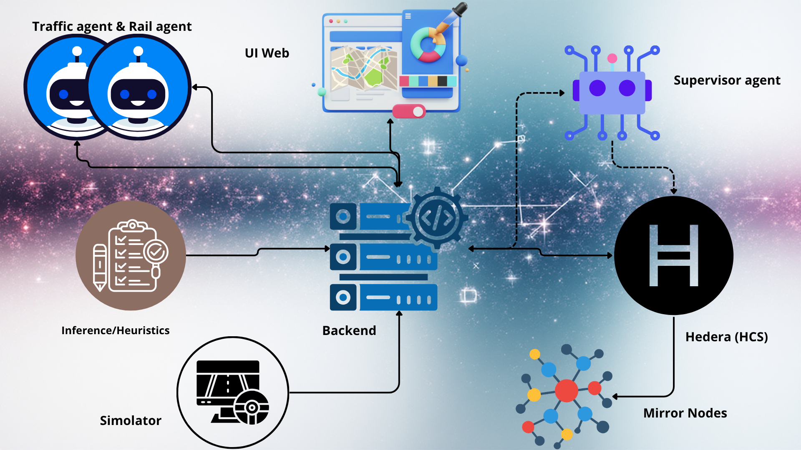

# mêmê Agents


Coordinated traffic and rail control with reinforcement-learning policies, Hedera Consensus Service logging, and an optional MapLibre front-end.


## Overview





- `apps/backend` – Node.js/Express API for ingesting sensor data, issuing control commands, and optionally persisting to Postgres and Hedera.


- `apps/agents` – Node.js workers that call the inference API, orchestrate control loops, and publish decisions to Hedera topics.


- `apps/inference` – FastAPI service that serves trained RL policies for traffic lights and rail barriers.


- `simulator` – Python simulators that stream mock traffic and rail events; `simulator/rl` holds training scripts and SUMO assets.


- `apps/web` – Vite/React MapLibre UI for visualising live congestion.


- `docker-compose.yml` – One-click stack (Postgres, backend, agents, inference, simulators).


## Hedera Integration

Hedera Consensus Service (HCS) anchors every traffic and rail decision to an immutable topic so supervisors can audit interventions and regulators can trace tampering attempts; we chose HCS because its predictable US$0.0001 message fee keeps compliance costs flat even for low-margin mobility operators in African corridors.

**Transactions Executed**
- `TopicCreateTransaction` when no topic ID is provided, letting new city pilots bootstrap automatically while persisting the topic ID for reuse.
- `TopicMessageSubmitTransaction` for every control decision emitted by the backend and agents, ensuring the same signed payload lands on HCS with consensus timestamps.

**Economic Justification**
Hedera's sub-cent, pre-quoted fees and ABFT finality let municipalities forecast logging spend to fractions of a dollar per day, while 10,000+ TPS headroom prevents congestion during peak commuting hours; together these traits keep the platform affordable for cash-constrained African transport agencies and trustworthy enough for citizen adoption.
## Prerequisites


- Docker Engine + Docker Compose plugin (recommended for the default stack).


- Node.js 18+ and npm (for running the backend/agents/web locally without containers).


- Python 3.11 with pip (for the simulators and inference service).


- SUMO (Simulation of Urban Mobility) binaries when training RL policies.


- Hedera account ID + private key when publishing decisions to the real HCS network (optional).


## Local Setup Checklist (Fresh Clone)


1. Review `.env` and update credentials or duplicate it to a private override such as `.env.local` before editing.


2. Create a Python 3.11 environment in the repo root and install dependencies shared by the inference service and simulators:


   ```bash


   python -m venv .venv


   . .venv/Scripts/activate    # or source .venv/bin/activate on Unix


   pip install --upgrade pip


   pip install -r apps/inference/requirements.txt


   pip install -r simulator/requirements.txt


   # optional: pip install -r simulator/rl/requirements.txt  # for training


   ```


3. Install JavaScript dependencies:


   ```bash


   npm install --prefix apps/backend


   npm install --prefix apps/agents


   npm install --prefix apps/web


   ```


4. Populate `simulator/rl/artifacts` with trained policy bundles before running the inference service. Copy the exported `.zip` and `.meta.json` pairs from your training run or download pre-trained assets, keeping the large files outside git history (see `simulator/rl/artifacts/README.md`). The file `simulator/rl/artifacts` is not empty, it contains the required files, but you can also do the training on your side following the instructions step.


5. For containerised runs, execute `docker compose build` (or `make up`) once to build images; for local processes, use the language-specific commands in the sections below whenever you need to start a service.


## Quick Start (Docker Compose)


1. Review `.env` and update credentials or topic IDs as needed. The compose file automatically loads it.


2. Build and start the stack:


   ```bash


   docker compose up --build


   ```


3. Open a new terminal to stream synthetic traffic (optional but useful for demos):


   ```bash


   python simulator/traffic_sim.py --target http://localhost:8000/ingest --rate 2 --junction A


   python simulator/rail_sim.py --target http://localhost:8000/ingest --pattern approach-30s


   ```


4. Check the services:


   - Backend health: http://localhost:8000/health


   - Inference API docs: http://localhost:8100/docs


   - Web map (if started separately): http://localhost:5173


5. Follow the logs when tuning: `docker compose logs -f backend agents`.


6. Stop everything with `docker compose down`.


Postgres data lives inside the container unless you mount a host volume. Hedera credentials are optional; without them the backend logs to the console only.


## Run Services Manually (without Docker)


### Backend API (Node.js)


```bash


cd apps/backend


npm install


npm run dev        # hot reload via tsx watch


# npm run build && npm start for a production bundle


```


Environment variables: `PORT` (defaults 8000), `DB_URL` or `DATABASE_URL`, and the Hedera keys/topic IDs.


### Policy Inference API (Python/FastAPI)


```bash


cd apps/inference


python -m venv .venv


. .venv/Scripts/activate    # or source .venv/bin/activate on Unix


pip install --upgrade pip


pip install -r requirements.txt


uvicorn apps.inference.src.infer_server:app --host 0.0.0.0 --port 8100


```


Model artifacts are not committed to git; populate `simulator/rl/artifacts` before starting the server (see `simulator/rl/artifacts/README.md`).


Adjust `MODEL_PATH`, `MODEL_METADATA_PATH`, `RAIL_MODEL_PATH`, and `RAIL_MODEL_METADATA_PATH` to point at policy artifacts (defaults to `simulator/rl/artifacts`).


### Agent Workers (Node.js)


```bash


cd apps/agents


npm install


npm run dev        # loops every 2s; npm run build && npm start for production


```


Key variables: `BACKEND_BASE_URL`, `TRAFFIC_INFER_URL`, `RAIL_INFER_URL`, `HCS_TOPIC_ID_*` (or the corresponding `HEDERA_TOPIC_*` values), and optional `AGENT_POLL_INTERVAL_MS`.


### Simulators (Python)


```bash


cd simulator


python -m venv .venv


. .venv/Scripts/activate


pip install -r requirements.txt


python traffic_sim.py --help


python rail_sim.py --help


```


Use `--target http://localhost:8000/ingest` to send events to the backend, or point at another URL when testing remotely.


### Web Map (Vite/React)


```bash


cd apps/web


npm install


npm run dev


```


Set `VITE_BACKEND_URL` and map provider keys (see below) before starting for live overlays.


## Reinforcement Learning Workflow


1. Install SUMO and expose the binaries to your PATH.


   - **Windows example:**


     ```cmd


     winget install --id Eclipse.SUMO -e


     setx SUMO_HOME "C:\Program Files (x86)\Eclipse\Sumo"


     setx PATH "%PATH%;%SUMO_HOME%\bin"


     setx PYTHONPATH "%SUMO_HOME%\tools"


     ```


   - On macOS/Linux, use Homebrew, apt, or the official binaries and export `SUMO_HOME`.


2. Create a Python 3.11 environment and install RL dependencies:


   ```bash


   python -m venv .venv


   . .venv/bin/activate


   pip install --upgrade pip


   pip install -r simulator/rl/requirements.txt


   ```


3. Train policies (adjust timesteps to your needs):


   ```bash


   python -m simulator.rl.train.train_traffic --total-timesteps 250000


   python -m simulator.rl.train.train_rail --total-timesteps 250000


   ```


   Artifacts land in `simulator/rl/artifacts`; copy the desired `.zip` and `.meta.json` to the paths read by the inference service.


4. Serve the trained models:


   ```bash


   export MODEL_PATH=simulator/rl/artifacts/traffic_policy.zip


   export MODEL_METADATA_PATH=simulator/rl/artifacts/traffic_policy.meta.json


   export RAIL_MODEL_PATH=simulator/rl/artifacts/rail/best_model.zip


   uvicorn apps.inference.src.infer_server:app --host 0.0.0.0 --port 8100


   ```


5. Point the agents at the running inference endpoint via `TRAFFIC_INFER_URL` and `RAIL_INFER_URL`.


## Generated Files & Repo Hygiene


- `.gitignore` excludes virtual environments, `node_modules/`, `dist/`, log files, TensorBoard runs, and other generated assets so commits stay light.


- Rebuild TypeScript output with `npm run build` in `apps/backend`, `apps/agents`, and `apps/web` before packaging or deploying; Docker images run the build step automatically.


- Keep inference policy bundles in `simulator/rl/artifacts`, but do not commit them; store or generate them per environment.


- Run `git status` before pushing to ensure only source changes are staged.


## Environment Variables


| Variable | Used by | Purpose | Default |


| --- | --- | --- | --- |


| `HEDERA_NETWORK` | backend, agents | Target Hedera network (`testnet`, `previewnet`, `mainnet`) | `testnet` |


| `HEDERA_ACCOUNT_ID` / `HEDERA_PRIVATE_KEY` | backend, agents | Operator credentials for publishing to HCS | empty |


| `HEDERA_TOPIC_TRAFFIC` / `HEDERA_TOPIC_RAIL` | backend, agents | Existing topic IDs; created automatically when empty | empty |


| `HCS_TOPIC_ID_SUPERVISOR` | agents | Optional supervisor topic id | `0.0.supervisorTopic` |


| `BACKEND_BASE_URL` | agents, web | Base URL for the backend API | `http://localhost:8000` |


| `TRAFFIC_INFER_URL` / `RAIL_INFER_URL` | agents | Inference endpoints for traffic and rail | `http://localhost:8100` |


| `API_PORT` / `PORT` | backend | HTTP port exposed by the backend | `8000` |


| `DB_URL` / `DATABASE_URL` | backend | Postgres connection string | `postgresql://postgres:postgres@db:5432/smartcity` |


| `VITE_MAPTILER_KEY`, `VITE_STADIA_KEY`, etc. | web | Map provider credentials (see `apps/web/README.md`) | empty |


| `SUMO_BIN`, `SUMO_NET`, `SUMO_ROU` | simulators, RL | Paths for SUMO CLI and network files | see `.env` |


Additional tuning knobs include `TRAFFIC_BATCH_LIMIT`, `RAIL_BATCH_LIMIT`, `AGENT_POLL_INTERVAL_MS`, and `CONTROLLER_*_URL` for overriding defaults in the agents.


## API Surface


- `POST /ingest` – accept `{ kind: 'traffic' | 'rail', location, value }` measurements.


- `GET /ingest/next?kind=traffic|rail` – retrieve the next pending measurement for an agent.


- `GET /ingest/snapshot?kind=traffic|rail` – latest value per location.


- `POST /control/traffic/set_plan` – apply a traffic light plan (mock controller).


- `POST /control/rail/set_barrier` – open/close rail barriers (mock controller).


- `GET /health` – service health probe.


- Inference service: `POST /traffic/infer`, `POST /rail/infer`, plus `/health` and Swagger UI under `/docs`.


## Helpful Commands


- `make up` / `make down` – wrap `docker compose` start/stop.


- `make logs` – follow backend and agent logs together.


- `make infer` – run the inference API locally.


- `make rl-smoke` – quick SUMO environment smoke test.


- `make rl-train` – start the default traffic training script.


## Troubleshooting


- **No decisions logged to Hedera:** ensure `HEDERA_ACCOUNT_ID`, `HEDERA_PRIVATE_KEY`, and topic IDs are set; otherwise the backend falls back to console logging.


- **Agents idle:** confirm the simulators are pushing data to `/ingest` and that `TRAFFIC_INFER_URL`/`RAIL_INFER_URL` resolve.


- **Model not found:** verify the artifacts referenced by `MODEL_PATH` exist and are readable inside the inference container.


- **SUMO errors on Windows:** restart the terminal after calling `setx` so the new PATH is picked up.


- **Port conflicts:** change `API_PORT`, `PORT`, or the Vite dev port before starting services that already bind those ports.


